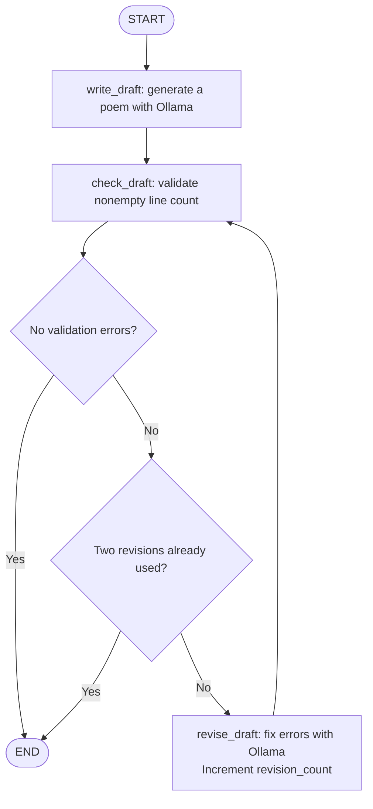

# LangGraph poems

A Typer CLI that writes poems using Ollama and checks their line counts with a
LangGraph workflow. Requires Python 3.14+, uv, and a running Ollama server with
`gemma2:9b` available.

```sh
uv sync
ollama pull gemma2:9b
uv run main.py poem "autumn rain" --tone peaceful --lines 5
uv run main.py haiku "autumn rain"
```

The workflow attempts at most two revisions after the initial draft. If the line
count still fails, it displays the draft and remaining issues. Haiku prompts ask
for a 5-7-5 syllable pattern, but validation checks only the three nonempty lines;
syllable counts are not verified.

## Workflow



The two decisions represent `route_after_check`, which runs after each check.
At `END`, the CLI displays the latest draft, any remaining validation errors,
and the number of revisions used.
